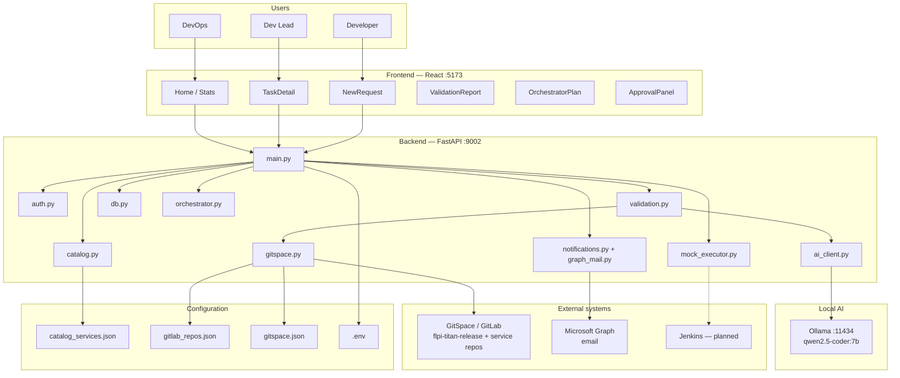
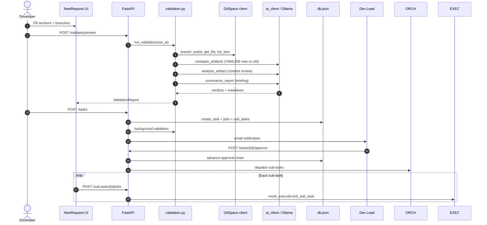
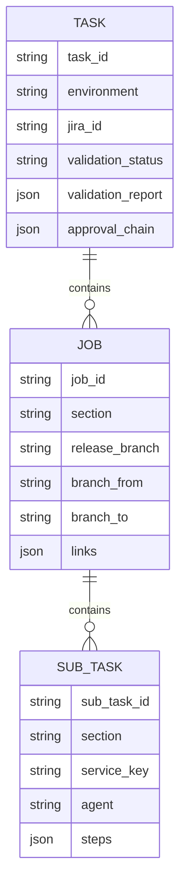
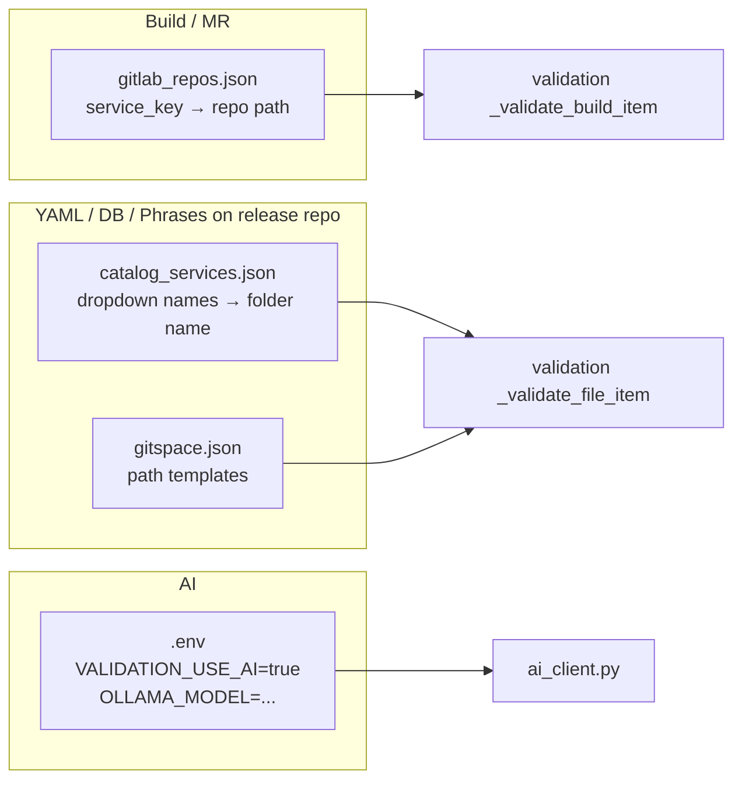
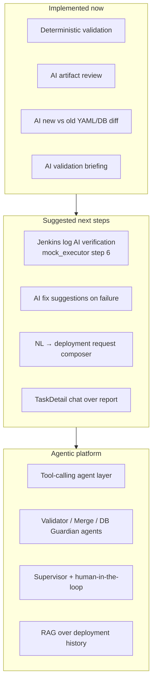

# Deployment Portal — Architecture

This document describes the **current** system and the **AI validation** flow (including new-vs-old YAML/DB comparison).

---

## 1. System context



---

## 2. Request lifecycle



---

## 3. AI validation — YAML baseline diff + DB Liquibase pre-check

Artifacts live on the **release repo** (`Titan/flpi-titan-release`):

```text
Microservices/{Service}/{Release}/YML/parameters.yml
Microservices/{Service}/{Release}/DB/Common.sql
Microservices/{Service}/{Release}/DB/INTEG.sql   (INTEG only)
Microservices/{Service}/{Release}/DB/UAT.sql     (UAT only)
Microservices/{Service}/{Release}/DB/PROD.sql  (PROD only)
```

### YAML (baseline comparison)

For each YAML file on the **new** release (e.g. `R-2026-06-W4`):

1. Resolves a **baseline** (old) release folder — e.g. `R-2026-06-W3`
2. Fetches **old** and **new** file content from GitSpace
3. Runs **deterministic** diff checks (YAML key changes)
4. Runs **AI** `compare_artifacts()` when `VALIDATION_USE_AI=true`

### DB (no baseline — Liquibase pre-checker)

For each service, merge env-specific SQL and validate deployability:

| Environment | Files merged |
|-------------|----------------|
| INTEG | `Common.sql` + `INTEG.sql` |
| UAT | `Common.sql` + `UAT.sql` |
| PROD | `Common.sql` + `PROD.sql` |

Only changesets with `labels:Approved` (or `labels:approved`) are validated; `labels:Pending` are ignored.
Changeset headers must use `-- Changeset author:id` (space after `--`).

Deterministic checks (`liquibase_validator.py`): Liquibase header, changeset `author:id` format,
Approved labels, duplicate IDs within merged changelog, empty changesets, basic SQL syntax,
destructive SQL warnings. AI `review_db_changelog()` provides **insights only** (never blocks).

```mermaid
flowchart LR
    subgraph Input["Request"]
        RB["release_branch<br/>R-2026-06-W4"]
        SVC["service_key<br/>yaml:microservice:account"]
    end

    subgraph Resolve["gitspace.py"]
        PATH["section_dir_for()<br/>Microservices/Account/R-2026-06-W4/YML"]
        BASE["resolve_baseline_release()<br/>→ R-2026-06-W3"]
        OLD_PATH["swap_release_in_path()<br/>.../R-2026-06-W3/YML/..."]
    end

    subgraph Fetch["GitSpace client"]
        NEW_F["get_file(ref=W4, role=new)"]
        OLD_F["get_file(ref=W3, role=old)"]
    end

    subgraph Checks["validation.py"]
        DET["Deterministic diff<br/>changeset collision, YAML keys"]
        AI_CMP["ai_client.compare_artifacts()"]
        AI_REV["ai_client.analyze_artifact()"]
    end

    subgraph Output["Report item"]
        CHK["checks[]"]
        URL["urls.file + urls.baseline_file"]
        INS["ai_insight"]
    end

    RB --> PATH
    SVC --> PATH
    PATH --> BASE
    BASE --> OLD_PATH
    PATH --> NEW_F
    OLD_PATH --> OLD_F
    NEW_F --> DET
    OLD_F --> DET
    DET --> AI_CMP
    NEW_F --> AI_REV
    DET --> CHK
    AI_CMP --> CHK
    AI_REV --> INS
    CHK --> Output
```



### Baseline resolution order

| Priority | Source |
|----------|--------|
| 1 | Env `VALIDATION_BASELINE_RELEASE` (global override) |
| 2 | Sibling folders under `Microservices/{Service}/` on the release branch (live GitSpace) |
| 3 | Heuristic `previous_release_label()` — e.g. `R-2026-06-W4` → `R-2026-06-W3` |

### Check types added to the report

| Check name | Section | Type | Example |
|------------|---------|------|---------|
| Duplicate changeset IDs | DB | Deterministic | Duplicate `pganesan:1` in merged changelog |
| Changeset labels | DB | Deterministic | Missing `labels:Approved` |
| SQL syntax | DB | Deterministic | Unbalanced quotes in Approved changeset |
| AI insights | DB | Ollama (advisory) | Migration risk summary — never blocks |
| YAML value changes | YAML | Deterministic | `server.port`: 8080 → 9090 |
| AI new vs old | YAML | Ollama | Semantic config diff vs baseline |
| AI content review | YAML / Phrases | Ollama | Syntax, structure |

---

## 4. Data model



---

## 5. Config map (where to change what)



---

## 6. Agentic roadmap (future)



---

## 7. Environment variables (AI + validation)

| Variable | Purpose |
|----------|---------|
| `VALIDATION_USE_AI` | `true` to enable Ollama checks |
| `OLLAMA_MODEL` | e.g. `qwen2.5-coder:7b` |
| `OLLAMA_BASE_URL` | Default `http://localhost:11434` |
| `VALIDATION_BASELINE_RELEASE` | Optional fixed baseline for all diffs |
| `GITSPACE_MODE` | `live` for real GitSpace API |
| `GITSPACE_TOKEN` | Read API token for live mode |

---

## 8. Key files

| File | Role |
|------|------|
| `backend/validation.py` | Orchestrates all checks; new-vs-old for YAML/DB |
| `backend/ai_client.py` | `compare_artifacts()`, `analyze_artifact()`, `summarize_report()` |
| `backend/gitspace.py` | Baseline resolution, GitSpace client, URL builders |
| `backend/main.py` | API routes, `VALIDATION_USE_AI` gate |
| `frontend/src/components/ValidationReport.jsx` | Shows checks, baseline link, AI status |
