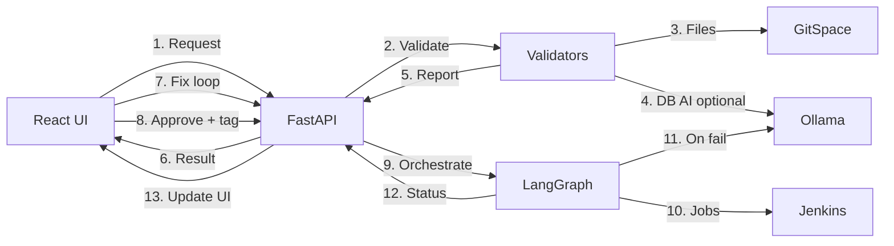

# Backend — Code Understanding Guides

These documents are **code walkthroughs**: each of `01`–`09` lists the **files used**, shows **real code excerpts**, and **explains** what those functions do and how they call each other — so you can understand that part of the system by reading the MD alone. **Docs only; they do not change runtime code.**

Paths below are relative to `deployment-portal/backend/`.

---

## How to use this folder

| If you want… | Start here |
|--------------|------------|
| End-to-end request lifecycle + all files | [09-master-orchestrator.md](./09-master-orchestrator.md) |
| Pre-submit checks (with code) | Docs `01`, `03`, `05`, `07` |
| Jenkins agents after approval (with code) | Docs `02`, `04`, `06`, `08` |
| Where Ollama is used | [03](./03-db-validation.md), [09 §8](./09-master-orchestrator.md) |

---

## Validation (pre-approval)

Validation reads artifacts from **GitSpace** and produces a structured `validation_report` on the task.

| Doc | Topic | AI in validation? |
|-----|--------|-------------------|
| [01-yaml-validation.md](./01-yaml-validation.md) | YAML (`parameters.yml`, `parameters-remove.yml`) | No (deterministic) |
| [03-db-validation.md](./03-db-validation.md) | Liquibase SQL | **Yes** — Ollama polishes flagged SQL |
| [05-phrases-validation.md](./05-phrases-validation.md) | Json / SchemaForms / NewSchemaForms | No |
| [07-build-validation.md](./07-build-validation.md) | Merge preview / MR | No |

**Shared entry:** `validators/validation.py` → `run_validation()`

**Triggered from `main.py`:**

| Path | Endpoint / trigger | Deep validation? |
|------|--------------------|------------------|
| Form shallow check | `POST /tasks/validate` | No — field/link checks only |
| Deep preview | `POST /validate/preview` | Yes — sync, no task |
| Create task | `POST /tasks` | Yes — background thread |
| Revalidate | `POST /tasks/{id}/revalidate` | Yes — background thread |

---

## Orchestration (post-approval)

After Dev Lead → (QA if freeze) → DevOps + `release_tag`, the LangGraph runner runs sub-tasks and triggers Jenkins.

| Doc | Agent | Jenkins job |
|-----|--------|-------------|
| [02-yaml-orchestrator.md](./02-yaml-orchestrator.md) | `yaml` | `YML_Automation_V3` |
| [04-db-orchestrator.md](./04-db-orchestrator.md) | `db` | `DB-Script-Automation-Liquibase` |
| [06-phrases-orchestrator.md](./06-phrases-orchestrator.md) | `phrases` | `Json_Automation_V2` |
| [08-build-orchestrator.md](./08-build-orchestrator.md) | `microservice` / `portal` | `Titan-Microservices` / `Titan-Portals` |
| [09-master-orchestrator.md](./09-master-orchestrator.md) | All | Phase plan, runner, shared graph, slots |

### Phase order

1. **Database migrations** — `db`
2. **YAML & Json & SchemaForms** — `yaml` then `phrases` (serial multi-file inside each service)
3. **Build & deploy** — `build` (capacity-gated parallel)

---

## Core files (cheat sheet)

| Area | Files |
|------|--------|
| API / kickoff | `main.py` |
| Validation | `validators/validation.py`, `yaml_validator.py`, `liquibase_validator.py` |
| GitSpace | `gitspace.py` |
| AI | `ai_client.py` |
| Orchestrator | `orchestrator/runner.py`, `graph.py`, `jenkins_params.py`, `jenkins_client.py`, `failure_rules.py` |
| Persistence | `db.py` |
| Config | `config/orchestrator_agents.json`, `config/jenkins_jobs.json`, `config/jenkins_*_map.json` |

---

## Big-picture flow

