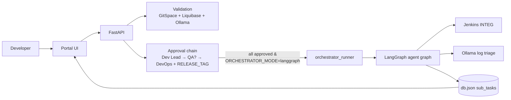
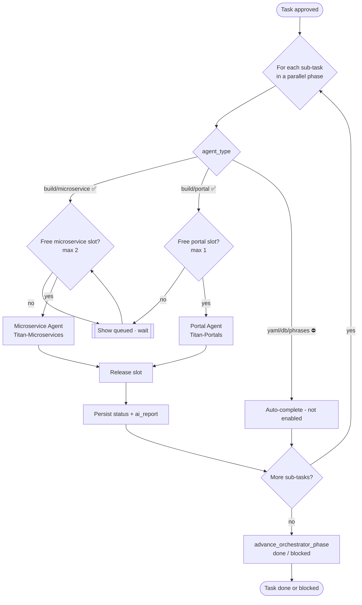
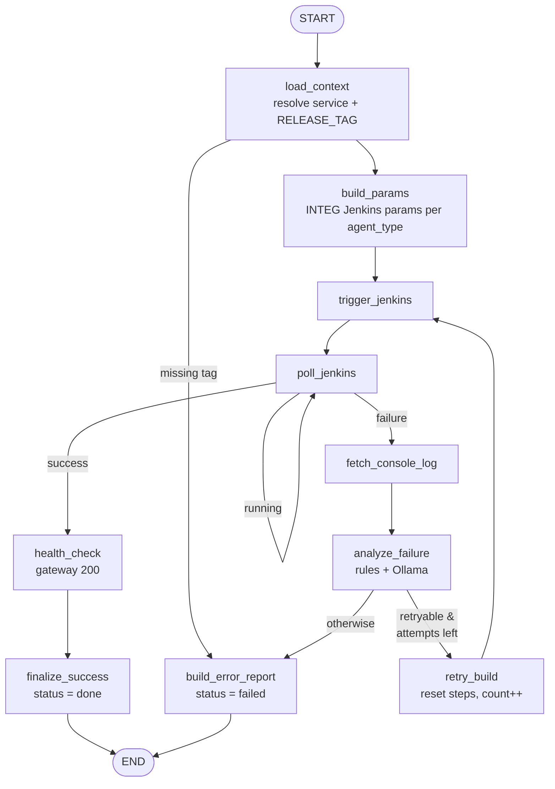
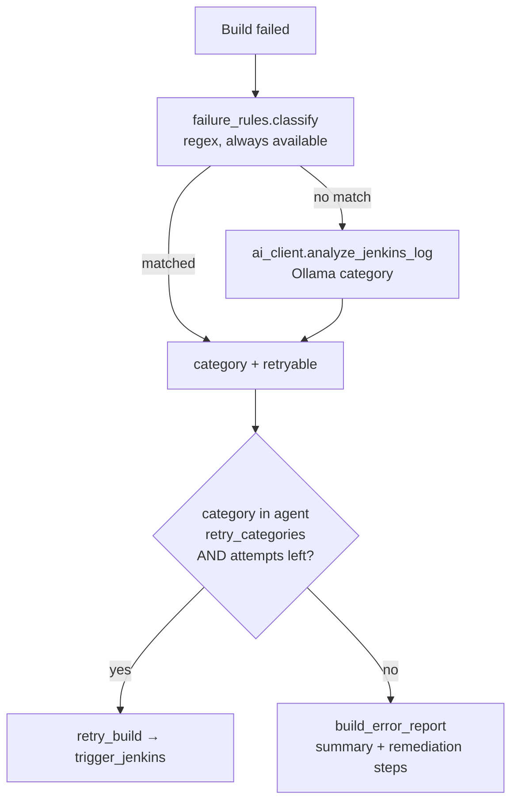

# Orchestrator Progress — Master Orchestrator & Agents

> **Living document.** Update this file whenever the orchestrator, the master
> orchestrator agent, or any sub-agent changes (nodes, edges, retry policy, new
> agent enabled, persisted fields). It must always reflect the *current* working
> of the LangGraph orchestrator.

_Last updated: 2026-07-10 — Microservice agent live (INTEG POC); portal/yaml/db/phrases agents scaffolded but disabled._

---

## 1. Where the orchestrator fits



- **Mode switch:** `ORCHESTRATOR_MODE` (`mock` | `langgraph`). In `mock`, the
  frontend ticks `mock_executor`. In `langgraph`, `orchestrator_runner` runs the
  compiled graph in a background thread and every node persists to `db.json`.
- **Trigger point:** final DevOps approval (`_maybe_start_orchestrator` in `main.py`).

---

## 2. Master orchestrator

The master orchestrator routes each portal **sub-task** to the **agent** that owns
its section. **Microservice** and **Portal** agents are enabled; the others are
declared in `config/orchestrator_agents.json` and reuse the same agent template.

Within a parallel phase every sub-task gets its own thread, but a **process-wide
build queue** gates how many actually run: a per-type slot semaphore caps
**2 microservice + 1 portal** concurrent builds (independent slots). Extras show
as `queued` until a running build of the same type frees a slot.



| Agent | `agent_type` | Jenkins job | Enabled | Max concurrent | Max retries | Retry categories |
|-------|--------------|-------------|---------|----------------|-------------|------------------|
| Microservice | `microservice` | `Titan-Microservices` | ✅ | 2 | 0 | heap_oom, transient_infra |
| Portal | `portal` | `Titan-Portals` | ✅ | 1 | 0 | heap_oom, transient_infra |
| YAML | `yaml` | yml_automation_2.0 | ⛔ | ∞ | 1 | transient_infra |
| DB | `db` | liquibase-runner | ⛔ | ∞ | 0 | — |
| Phrases | `phrases` | phrase-deploy | ⛔ | ∞ | 1 | transient_infra |

Config: `backend/config/orchestrator_agents.json`. `max_concurrent` sets the
process-wide build-queue slot count per type (0 = unlimited). Env overrides:
`ORCHESTRATOR_MAX_MICROSERVICE`, `ORCHESTRATOR_MAX_PORTAL`.

---

## 3. Agent subgraph (Microservice / Portal — shared template)

Microservice and Portal share this graph; `build_params` selects Titan-Microservices
or Titan-Portals parameters based on `agent_type`.



**Nodes** (`backend/orchestrator/graph.py`):

| Node | Purpose | Persists |
|------|---------|----------|
| `load_context` | Load task, resolve `service_label` + `RELEASE_TAG`, agent policy | step 0, retry_count |
| `build_params` | Build Titan-Microservices params (INTEG/INTEG, tag) | step 1 |
| `trigger_jenkins` | Trigger build (real or mock build number) | step 2, build number |
| `poll_jenkins` | Poll status; loop while running | step 3 |
| `health_check` | Post-build gateway probe (mock 200 in POC) | step 4 |
| `fetch_console_log` | Pull console tail for a failed build | logs |
| `analyze_failure` | `failure_rules.classify()` + `ai_client.analyze_jenkins_log()` | failure_category, ai_report |
| `retry_build` | Reset downstream steps, backoff, loop back to trigger | steps 3–5, retry_count |
| `build_error_report` | Terminal failure with remediation | status=failed, ai_report |
| `finalize_success` | Success verification report | status=done, ai_report |

---

## 4. Failure handling — loop back vs report

Two layers decide the outcome; **only `heap_oom` and `transient_infra` auto-retry**
(and only while `retry_count < max_retries` for that agent).



| Category | Retryable | Example log signal | Action |
|----------|-----------|--------------------|--------|
| `heap_oom` | ✅ | `OutOfMemoryError`, `Java heap space`, exit 137 | Loop back, re-run |
| `transient_infra` | ✅ | connection reset, timeout, agent offline, 5xx | Loop back, re-run |
| `build_error` | ❌ | compile error, failing tests | Report — needs code fix |
| `config_error` | ❌ | bad/missing param, RELEASE_TAG, 401/403 | Report — DevOps fix |
| `dependency_error` | ❌ | artifact/registry pull denied | Report — fix dependency |
| `unknown` | ❌ | unclassified | Report, no auto-retry |

**Ollama triage output** (`ai_report` persisted on the sub-task):

```json
{
  "category": "heap_oom",
  "retryable": true,
  "ai_available": true,
  "confidence": 88,
  "summary": "Build failed due to Java heap space during tests",
  "root_cause": "Report aggregator loads full dataset in memory",
  "remediation_steps": ["Increase JVM -Xmx in the job", "Re-run after peak load"],
  "attempt": 1
}
```

If Ollama is offline, `ai_available=false` and the deterministic rule category +
generic guidance are used — the pipeline never hard-depends on AI.

---

## 5. Persisted sub-task fields (for the UI)

Written by `db.record_agent_event`; shown in `OrchestratorPlan.jsx` (DevOps/lead):

| Field | Meaning |
|-------|---------|
| `status` | queued / running / done / failed |
| `steps[].status` / `.detail` | live per-step progress |
| `jenkins_build_number` | real or mock build number |
| `jenkins_build_url` | deep link to the Jenkins build (console) |
| `console_log` | live Jenkins console tail, refreshed every poll |
| `build_only` | build-only run (no merge / blank MergeID) |
| `retry_count` | auto-retry attempts so far |
| `failure_category` | last classified failure |
| `ai_report` | summary + root cause + remediation (AI report card) |
| `logs[]` | timestamped agent log lines |

**Live Jenkins console:** `poll_jenkins` fetches the console tail
(`jenkins_client.get_console_text`, ~120 lines) on every poll and persists it to
`console_log`. `OrchestratorPlan.jsx` renders it in an auto-scrolling terminal box
with a blinking **● LIVE** badge while the build is running, plus an "Open in
Jenkins" deep link. DevOps see it stream as the portal polls `/tasks/{id}/full`.

**Build-only mode:** the New Request → Build card has an "Only build (no merge)"
toggle. When on, the branch pair is hidden and not required; the request is
submitted with `build_only=true` and empty branches, and the microservice agent
triggers Jenkins with a blank `MergeID` (build only, no merge).

---

## 6. Running & testing

**Portal (langgraph mode):**

```bash
# backend/.env
ORCHESTRATOR_MODE=langgraph
# optional, exercise failure paths without Jenkins:
ORCHESTRATOR_DEMO_SCENARIO=fail_heap   # success | fail_build | fail_heap
```

Then approve a build request through to DevOps (with RELEASE_TAG) and watch the
orchestrator plan update live.

**Standalone in LangGraph Studio:**

```bash
cd deployment-portal/backend && source .venv/bin/activate && langgraph dev
```

Input:

```json
{ "task_id": "TASK-1", "service_label": "Account",
  "release_tag": "R-2026-07-W1", "demo_scenario": "fail_heap" }
```

| Scenario | Result |
|----------|--------|
| `success` | trigger → poll → health → success report |
| `fail_build` | fail → classify `build_error` → error report (no retry) |
| `fail_heap` | fail → `heap_oom` → retry once → success |

---

## 7. Roadmap (enable one agent at a time)

- [x] Microservice agent (INTEG) with retry + Ollama triage
- [x] Portal agent (Titan-Portals) — same graph, portal Jenkins params
- [ ] YAML agent (yml_automation) — validate-then-deploy nodes
- [ ] DB agent (liquibase-runner) — link to Liquibase validation hints
- [ ] Phrases agent (phrase-deploy)
- [x] Parallel fan-out within a phase (thread per sub-task in langgraph runner)
- [x] Build concurrency queue — process-wide slots (2 microservice + 1 portal), extras `queued`
- [ ] HITL interrupt before trigger (pause for RELEASE_TAG via `interrupt()`)
- [ ] Checkpointer for resume-after-restart mid-poll
- [ ] Failure notifications (email/Teams on `blocked`)

---

## 8. File map

| File | Role |
|------|------|
| `backend/orchestrator/graph.py` | Agent graph (nodes, edges, routing) — exported for Studio |
| `backend/orchestrator/runner.py` | Background invoke + drive sub-tasks in portal |
| `backend/orchestrator/config.py` | Agent registry + retry policy loader |
| `backend/config/orchestrator_agents.json` | Agent definitions |
| `backend/orchestrator/failure_rules.py` | Deterministic failure classification |
| `backend/ai_client.py` → `analyze_jenkins_log()` | Ollama failure triage |
| `backend/orchestrator/jenkins_client.py` / `jenkins_params.py` | Jenkins trigger/poll + param map |
| `backend/db.py` → `record_agent_event()` | Persist agent progress to sub-tasks |
| `frontend/src/components/OrchestratorPlan.jsx` | AI report card + live steps + live Jenkins console |
| `frontend/src/components/LinkSectionEditor.jsx` | Build card + "Only build (no merge)" toggle |
| `backend/langgraph.json` | Studio graph manifest |
