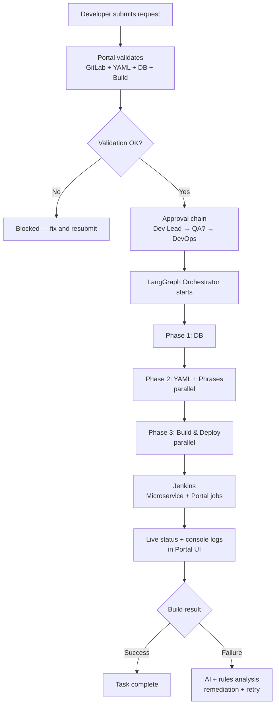
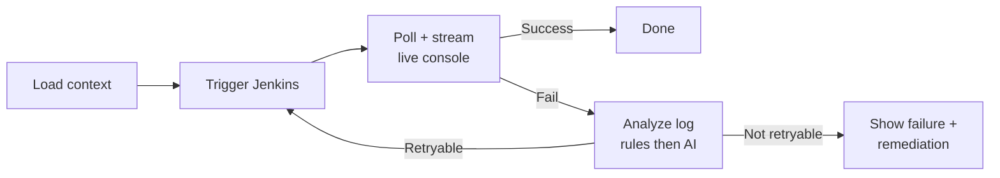

# AI Deployment Automation Portal — Week 3 Progress

**Paste into Gemini with:**
> Create a clean professional PPT (10 slides max). Use simple flow diagrams on workflow slides. Corporate style, minimal text per slide, clear visuals.

---

## SLIDE 1 — Title
**AI-Assisted Deployment Automation Portal**
Week 3 Progress | INTEG Environment | Jul 2026

POC is working. This week we added live Jenkins orchestration and are ready for AWS deployment.

---

## SLIDE 2 — What the Portal Does (One-liner)
A single place where developers submit deployment requests, get AI-assisted validation, go through approvals, and DevOps runs parallel Jenkins builds — with live logs and failure analysis — without leaving the portal.

---

## SLIDE 3 — End-to-End Workflow (MAIN SLIDE)
**Use a large flow diagram. This is the most important slide.**



**Simple text version (if diagram needed as bullets):**
Submit → Validate → Approve → Orchestrate (DB → Config → Build) → Jenkins → Live UI updates

---

## SLIDE 4 — Validation & Approval
**Two small flows side by side**

**Validation**
- GitSpace checks (branches, MR, artifacts)
- YAML / DB / Build checks + AI report
- Result: Approve-ready / Needs attention / Blocked

**Approval**
- Dev Lead approves or rejects
- If code freeze → QA approves
- DevOps approves + sets RELEASE_TAG
- Only then orchestrator starts

---

## SLIDE 5 — Orchestrator: How Builds Run
After approval, builds run in 3 phases:

| Phase | What runs | How |
|-------|-----------|-----|
| 1 | DB migrations | Sequential |
| 2 | YAML + Phrases | Parallel |
| 3 | Microservice + Portal builds | Parallel, but **queued** |

**Build agents (live today):**
- Microservice → Jenkins job `Titan-Microservices`
- Portal → Jenkins job `Titan-Portals`

YAML, DB, Phrases agents — planned next.

---

## SLIDE 6 — Single Build Agent Flow
**One LangGraph graph per build (Microservice or Portal)**



Steps DevOps sees: Validate → Params → Trigger → Wait → Health → Verify

---

## SLIDE 7 — Smart Build Queue
**Problem:** Too many parallel builds overload Jenkins → builds get cancelled.

**Solution:** Capacity gate — max **2 microservices + 1 portal** at a time.

```
Tax + Shipping  → RUNNING  (2 MS slots full)
Sftpsync        → QUEUED   (waits for a slot)
Portal-Account  → RUNNING  (1 portal slot full)
2nd portal      → QUEUED

Slot frees → next build starts automatically
Also checks Jenkins for builds already running outside the portal
```

---

## SLIDE 8 — Failure Handling
When a build fails:

1. **Rules first** — match known patterns (OOM, cancelled, compile error)
2. **AI second** — if rules are unsure, analyze console log
3. **Portal shows** — category, root cause, fix steps
4. **Retry** — DevOps can retry manually; build history shows all attempts

| Failure type | Auto-retry? |
|--------------|-------------|
| User aborted / compile error | No |
| OOM / infra timeout | Yes |

---

## SLIDE 9 — What We Delivered This Week
- Live Jenkins orchestration (Microservice + Portal agents)
- Smart queue (2 MS + 1 Portal, Jenkins-aware)
- Live Jenkins console inside portal (LIVE badge)
- Failure analysis (rules + AI) with retry + build history
- Build-only mode (INTEG build without merge/MR)
- Codebase organized: `orchestrator/`, `validators/`, `docs/`
- Production plan: AWS ECS + RDS + SES + Bedrock (~$170–280/mo)

---

## SLIDE 10 — Next Steps & Ask
**Next (production):**
- Move `db.json` → RDS PostgreSQL
- Deploy to AWS ECS (INTEG)
- AWS SES for email, Bedrock for AI

**Future (v2):**
- Enable YAML / DB / Phrases agents
- Incident knowledge base (system learns from past failures)

**Ask:** Go-ahead to start AWS implementation.

---

## NOTES FOR GEMINI (do not put on slides)
- Audience: engineering manager, non-deep technical
- Keep each slide to 4–6 bullets max
- Slides 3, 6, 7 must have visual flow diagrams
- Avoid jargon: LangGraph Studio is dev-only, not in production
- Demo in 5 min: submit request → validation → approve → see queue + live logs → show failure + retry
